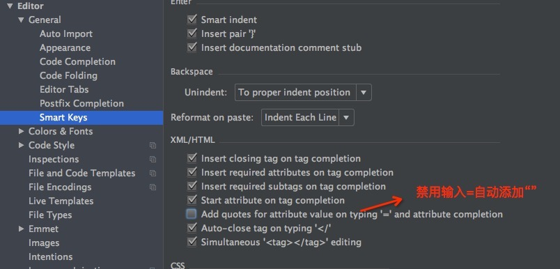

#### WebStrom 开发环境配置
1. 确定启用node环境 Language & FrameWorks -> Node And Npm -> Node Core Library enable 为 `enable`
2. Javascript Version 为 `JSX Harmony`
3. Javascript -> Libray -> ECMAScript 6 勾选
4.

#### ESLint配置 代码质量控制
全局安装 `ESLint`和`eslint-plugin-react`

```
npm install -g eslint eslint-plugin-react
```

#### 解决输入等号自动加双引号的问题

